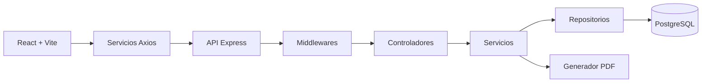
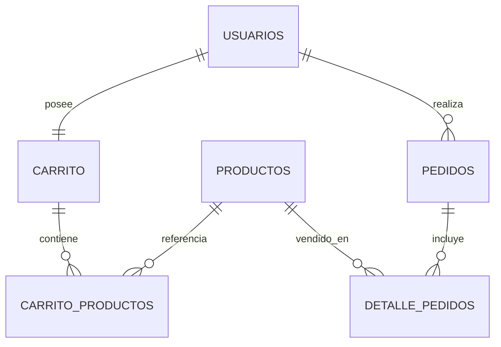

# Sistema de Carrito de Compras - Ecommerce

<a id="descripcion"></a>
## 📖 Descripción breve y clara del propósito del proyecto
Aplicación web comercial para gestionar un flujo completo de compras en linea: autenticación por roles, catálogo de productos, carrito persistente, checkout con control de stock, historial de pedidos, dashboard de indicadores y generación de reportes en PDF. El objetivo es centralizar operaciones de venta y ofrecer trazabilidad funcional tanto para clientes como para perfiles de gestión.

<a id="tabla-de-contenido"></a>
## 📑 Tabla de contenido
- [Descripcion breve y clara del proposito del proyecto](#descripcion)
- [Tabla de contenido](#tabla-de-contenido)
- [Caracteristicas principales](#caracteristicas)
- [Stack tecnologico](#stack)
- [Arquitectura del proyecto](#arquitectura)
- [Modelo de base de datos](#modelo-bd)
- [Estructura de carpetas](#estructura)
- [Variables de entorno](#variables)

<a id="caracteristicas"></a>
## ✨ Características principales
- Autenticación y autorización por roles: admin, gestor y cliente.
- Gestión de productos con operaciones CRUD y filtros de búsqueda.
- Carrito persistente por usuario con actualización de cantidades.
- Validaciones de negocio de stock:
  - No se permite comprar más unidades de las disponibles.
  - Límite máximo de stock y cantidad por producto de 100 unidades.
- Proceso de checkout transaccional con generación de pedido y detalle de compra.
- Dashboard con KPIs y gráficos de ventas (Recharts).
- Reportes PDF operacionales y de gestión con formato profesional.
- API REST con documentación Swagger disponible en runtime.
- Manejo centralizado de errores y validación de solicitudes.

<a id="stack"></a>
## 🛠️ Stack tecnológico
- Lenguajes:
  - JavaScript (Node.js y React).
  - SQL (PostgreSQL).
- Backend:
  - Express 4.
  - Sequelize 6.
  - pg.
  - express-session.
  - express-validator.
  - pdfkit.
  - swagger-ui-express.
- Frontend:
  - React 18.
  - React Router DOM 6.
  - Axios.
  - Recharts.
  - Vite 5.
  - Tailwind CSS.
- Herramientas de desarrollo:
  - Nodemon.
  - PostCSS + Autoprefixer.

<a id="arquitectura"></a>
## 🏗️ Arquitectura del proyecto
El proyecto aplica una arquitectura cliente-servidor con separación por capas en backend y modularización por contexto funcional en frontend.

- Patrón principal en backend: Controller -> Service -> Repository -> Model (Sequelize).
- Flujo de datos:
  - El cliente React consume endpoints REST mediante Axios.
  - Las rutas Express validan y delegan a controladores.
  - Los servicios encapsulan reglas de negocio y transacciones.
  - Los repositorios gestionan acceso a datos con Sequelize/PostgreSQL.
- Estado en frontend:
  - Context API para autenticación y carrito.
  - Hooks personalizados para reutilizar lógica de dominio.



<a id="modelo-bd"></a>
## 🗃️ Modelo de base de datos
Tablas principales:
- usuarios
- productos
- carrito
- carrito_productos
- pedidos
- detalle_pedidos

Relaciones clave:
- Un usuario tiene un carrito.
- Un carrito contiene muchos items (carrito_productos).
- Un pedido pertenece a un usuario.
- Un pedido tiene muchos detalles (detalle_pedidos).
- Cada detalle referencia un producto.



<a id="estructura"></a>
## 📁 Estructura de carpetas
```text
proyecto-carrito/
|-- backend/                      # API REST y logica de negocio
|   |-- server.js                 # Punto de entrada del backend
|   |-- package.json              # Scripts y dependencias backend
|   `-- src/
|       |-- app.js                # Configuracion de Express
|       |-- config/               # Conexion BD y bootstrap
|       |-- controllers/          # Orquestacion HTTP
|       |-- dtos/                 # Transformacion de respuestas
|       |-- middlewares/          # Auth, roles, validacion, errores
|       |-- models/               # Definicion Sequelize y relaciones
|       |-- repositories/         # Acceso a datos
|       |-- routes/               # Endpoints por modulo
|       |-- services/             # Reglas de negocio
|       `-- utils/                # Utilidades (JWT, bcrypt, PDF)
|-- frontend/                     # Aplicacion React
|   |-- package.json              # Scripts y dependencias frontend
|   |-- public/                   # Recursos publicos
|   `-- src/
|       |-- App.jsx               # Ruteo principal
|       |-- components/           # Componentes UI por dominio
|       |-- context/              # Estado global (auth y carrito)
|       |-- hooks/                # Hooks personalizados
|       |-- pages/                # Pantallas de negocio
|       |-- services/             # Cliente HTTP y servicios
|       |-- assets/               # Recursos estaticos locales
|       `-- utils/                # Formateadores y utilidades
|-- sql/                          # Scripts DDL y seed
|   |-- create_database.sql       # Estructura de base de datos
|   |-- datos.sql                 # Datos iniciales
|   `-- README.md                 # Guia SQL del proyecto
`-- README.md                     # Documentacion principal
```

<a id="variables"></a>
## 🔑 Variables de entorno
```env
# Host del servidor PostgreSQL
DB_HOST=localhost

# Puerto de PostgreSQL
DB_PORT=5432

# Nombre de la base de datos del proyecto
DB_NAME=carrito_compras

# Usuario con permisos sobre la base de datos
DB_USER=postgres

# Contrasena del usuario de base de datos
DB_PASSWORD=sa
```
