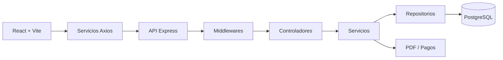
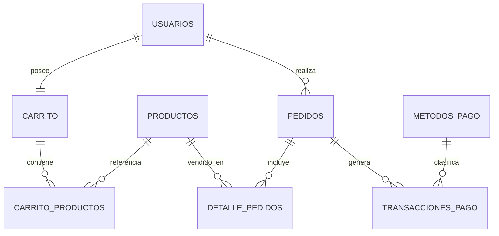

# Sistema de Carrito de Compras - Ecommerce

## 📖 Descripción breve y clara del propósito del proyecto
Aplicación web comercial para gestionar un proceso de compra completo: autenticación por roles, catálogo de productos, carrito persistente, pasarela de pagos simulada, generación de pedidos, historial de transacciones, dashboard de indicadores y reportes PDF. El proyecto centraliza la operación de venta y la trazabilidad de compras para clientes, gestores y administradores.

## 📑 Tabla de contenido
- [Descripción breve](#descripcion)
- [Características principales](#caracteristicas)
- [Stack tecnológico](#stack-tecnologico)
- [Arquitectura del proyecto](#arquitectura-del-proyecto)
- [Modelo de base de datos](#modelo-de-base-de-datos)
- [Estructura de carpetas](#estructura-de-carpetas)
- [Variables de entorno](#variables-de-entorno)
- [Documentación complementaria](#documentacion-complementaria)

## ✨ Características principales
- Autenticación y autorización por roles: administrador, gestor y cliente.
- Catálogo de productos con CRUD, búsqueda, filtros y visualización de imágenes.
- Carrito persistente por usuario con actualización de cantidades.
- Validación de stock en carrito, checkout y productos.
- Pasarela de pagos simulada con métodos, validaciones y transacciones.
- Historial de pedidos y transacciones con detalle completo.
- Dashboard con KPIs y gráficos interactivos.
- Generación de reportes PDF operacionales y de gestión.
- API REST documentada con Swagger.
- Manejo centralizado de errores y validación de solicitudes.

## 🛠️ Stack tecnológico
- Lenguaje principal: JavaScript.
- Backend: Node.js, Express, Sequelize, PostgreSQL, express-session, express-validator, pdfkit, swagger-ui-express.
- Frontend: React 18, React Router DOM, Axios, Recharts, Vite.
- Estilos y tooling: Tailwind CSS, PostCSS, Autoprefixer, Nodemon.

## 🏗️ Arquitectura del proyecto
El sistema sigue una arquitectura cliente-servidor por capas. En backend se utiliza el flujo Controller -> Service -> Repository -> Model, mientras que en frontend se organiza por páginas, componentes, servicios, hooks y contextos.

- El frontend consume la API REST mediante Axios.
- Los controladores reciben, validan y enrutan la petición.
- Los servicios concentran las reglas de negocio y transacciones.
- Los repositorios encapsulan el acceso a PostgreSQL a través de Sequelize.
- La pasarela de pagos y los reportes se integran como módulos funcionales del dominio comercial.



## 🗃️ Modelo de base de datos
Tablas principales:
- usuarios
- productos
- carrito
- carrito_productos
- pedidos
- detalle_pedidos
- metodos_pago
- transacciones_pago

Relaciones clave:
- Un usuario tiene un carrito.
- Un carrito contiene múltiples productos en carrito_productos.
- Un pedido pertenece a un usuario.
- Un pedido tiene varios detalle_pedidos.
- Cada detalle_pedido referencia un producto.
- Una transacción de pago pertenece a un método de pago y a un pedido.



## 📁 Estructura de carpetas
```text
proyecto-carrito/
|-- backend/                      # API REST, reglas de negocio y acceso a datos
|   |-- server.js                 # Punto de arranque del backend
|   |-- package.json              # Scripts y dependencias del backend
|   `-- src/
|       |-- app.js                # Configuración de Express y rutas
|       |-- config/               # Base de datos y bootstrap
|       |-- controllers/          # Capa HTTP
|       |-- dtos/                 # Formato de respuestas
|       |-- middlewares/          # Autenticación, roles, validación y errores
|       |-- models/               # Modelos Sequelize y relaciones
|       |-- repositories/         # Persistencia y consultas
|       |-- routes/               # Endpoints por módulo
|       |-- services/             # Lógica de negocio
|       `-- utils/                # Utilidades (JWT, bcrypt, PDF)
|-- frontend/                     # Aplicación React
|   |-- package.json              # Scripts y dependencias del frontend
|   |-- public/                   # Recursos públicos
|   `-- src/
|       |-- App.jsx               # Ruteo principal
|       |-- components/           # Componentes reutilizables
|       |-- context/              # Estado global
|       |-- hooks/                # Hooks personalizados
|       |-- pages/                # Pantallas del sistema
|       |-- services/             # Cliente HTTP y servicios
|       |-- assets/               # Imágenes y recursos locales
|       `-- utils/                # Formateadores y utilidades
|-- sql/                          # Scripts de base de datos y datos iniciales
|   |-- create_database.sql       # Estructura de tablas
|   |-- datos.sql                 # Seed de ejemplo
|   `-- README.md                 # Guía SQL
|-- MANUAL_USUARIO.md             # Guía de uso funcional
|-- MANUAL_INSTALACION.md         # Guía de despliegue y puesta en marcha
`-- README.md                     # Documentación principal
```

## 🔑 Variables de entorno
```env
# Host del servidor PostgreSQL
DB_HOST=localhost

# Puerto del servidor PostgreSQL
DB_PORT=5432

# Nombre de la base de datos del proyecto
DB_NAME=carrito_compras

# Usuario de PostgreSQL
DB_USER=postgres

# Contraseña del usuario de PostgreSQL
DB_PASSWORD=sa
```

## 📘 Documentación complementaria
- [Manual de usuario](MANUAL_USUARIO.md)
- [Manual de instalación](MANUAL_INSTALACION.md)
- [Guía SQL](sql/README.md)

